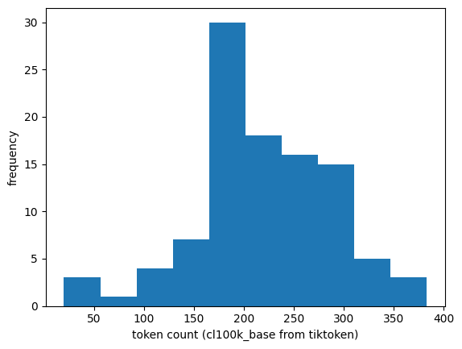

# Offline RAG Evaluation Guide

This document explains how offline retrieval evaluation works in this pipeline — what it measures, how the metrics are computed, and how to interpret the results.

---

## How it works end-to-end

### 1. Build a labeled testset

Each entry is a (question, reference_contexts) pair — a question and the chunk(s) that contain the correct answer. In our code this comes from either:
- Ragas `TestsetGenerator` (LLM generates Q&A pairs from your document), or
- A hand-written JSON file you provide via `--testset`

This is the only step that requires any LLM calls. Once saved with `--save-testset`, you never pay that cost again.

### 2. Run retrieval against each question

For each question in the testset, the pipeline runs exactly as it would in production:
- Stage 1: hybrid search → top-20 candidates
- Stage 2: reranker → top-5 final chunks

No LLM is involved here — it's just vector search + reranking.

### 3. Score each result against the labels

For each retrieved chunk, `_is_relevant()` checks whether it overlaps with the reference contexts (Jaccard similarity ≥ 0.3). This gives a binary relevance signal per chunk, which feeds into:

| Metric | What it asks |
|---|---|
| Recall@K | Did the retriever surface the right chunk at all? |
| Precision@K | Of what it returned, how much was actually useful? |
| Hit@K | Did even one correct chunk make it in? |
| MRR | How high up was the first correct chunk? |
| NDCG@K | Were correct chunks ranked near the top? |
| Chunk diversity | Are the returned chunks actually different from each other? |

### 4. Average across all questions → report

Each metric is computed per question, then averaged. The delta section shows what the reranker added over the raw retriever at the same K.

---

## Key insight

**Offline means the ground truth is fixed.** You run the same testset repeatedly as you tune chunk size, embedding model, or reranker — and the scores are directly comparable because the labels never change. That's what makes it useful for iteration.

The main weakness is that `_is_relevant` uses lexical overlap (Jaccard), not semantic similarity — so a paraphrase of the reference context might score as irrelevant.

---

## Do the reference contexts need to match the number of retrieved chunks?

No. The reference contexts and the retrieved chunks operate on completely different scales and don't need to match.

- **Reference contexts** — typically 1–3 per question, representing the ground-truth passages that contain the answer. These come from your testset.
- **Retrieved chunks** — however many your pipeline returns (top-N after reranking, e.g. 5 or 20).

The metrics handle the asymmetry naturally:

- **Recall** divides by the number of reference contexts, not retrieved chunks — so it's unaffected by top-N.
- **Precision** divides by K (the number retrieved) — unaffected by how many references exist.
- **Hit@K** just needs at least one match — doesn't care about counts on either side.
- **`_is_relevant`** checks each retrieved chunk independently against all reference contexts — again no count dependency.

The only implicit assumption is that at least one reference context should be retrievable from your collection (i.e., it was ingested). If a reference context has no lexical overlap with any stored chunk, Recall will be stuck at 0 regardless of retrieval quality — but that's a testset quality issue, not a count mismatch.

### Chunk size and overlap decision

The reference context token counts in the Ragas-generated testset (`ragas_testset.json`) were measured using tiktoken's `cl100k_base` encoding — the same tokenizer used by `TokenTextSplitter` in the ingest pipeline. The histogram of those counts shows:

- Distribution peaks at **150–200 tokens**
- Most reference contexts fall between **100–350 tokens**
- Current chunk size: **400 tokens**, overlap: **60 tokens**

Since reference contexts are consistently smaller than the chunk size, a retrieved chunk will typically *contain* the full reference context within it. This means Jaccard will find strong word overlap — the reference words are a subset of the chunk words — so the eval signal is reliable at the current settings.

Reducing chunk size to ~200 tokens would align more tightly with the reference context distribution and is worth exploring as a production tuning decision (tighter chunks = less noise sent to the LLM). However, this is a retrieval quality concern, not an eval correctness issue. The current 400/60 settings are sufficient to proceed with offline evaluation without adjustment.

### Effect of one reference context per question

Ragas by default generates one reference context per question. With a single reference context, Recall = relevant_found / 1, which is always 0.0 or 1.0 — making it **identical to Hit@K**. You effectively get 4 distinct signals instead of 5.

| Metric | Affected? |
|---|---|
| Recall@K | Becomes binary — redundant with Hit@K |
| Hit@K | Redundant with Recall |
| Precision@K | Unaffected |
| MRR | Unaffected — still measures rank of the one relevant chunk |
| NDCG@K | Less discriminative but still valid |

This does not break the eval — MRR, Precision, and NDCG still give meaningful signal. If you want Recall to be a distinct metric, hand-annotate a subset of questions with multiple reference contexts, or adjust the Ragas generation prompt to produce more.

---

## How scores are reported

There are two sets of averaged numbers in the report, not one:

- **Stage 1** — averaged over all questions at k=20 (retriever)
- **Stage 2** — averaged over all questions at k=5 (reranker)
- **Delta** — Stage 2 minus Stage 1 at the same k, to isolate the reranker's contribution

Chunk diversity follows the same pattern — one average per stage across all questions.

---

## Worked example: Recall@20 over 5 questions

Setup: 5 questions, 3 reference chunks per question, k=20 (Stage 1), top_n=3 (Stage 2).

For each question, recall is:

> how many of the 3 reference chunks appeared in the retrieved results / 3

So for one question, if 2 out of 3 reference chunks were found in the top-20 candidates → Recall = 2/3 = 0.67

Across all 5 questions, say the per-question recalls are:

| Question | Relevant found | Recall |
|---|---|---|
| Q1 | 3/3 | 1.00 |
| Q2 | 2/3 | 0.67 |
| Q3 | 1/3 | 0.33 |
| Q4 | 3/3 | 1.00 |
| Q5 | 2/3 | 0.67 |

**Stage 1 Recall@20** = (1.00 + 0.67 + 0.33 + 1.00 + 0.67) / 5 = **0.73**

The same calculation repeats for Stage 2 but now checking whether those reference chunks appear in the top-3 reranked results instead of the top-20 — you'd expect this to drop since you're looking in a much smaller window.

One thing worth noting: "appeared in the top-20" is determined by `_is_relevant()` using Jaccard overlap, not exact string match — so a retrieved chunk doesn't need to be identical to the reference, just share enough vocabulary (≥ 0.3 Jaccard).

After retrieval, _is_relevant() uses Jaccard to decide whether each retrieved chunk counts as relevant against the reference contexts. This happens for both stages.

---

## Using pre-built datasets (e.g. RAGBench): drawbacks and lessons learned

### What RAGBench is

RAGBench (`rungalileo/ragbench`) is a 100k-example benchmark with pre-labeled relevance at the sentence level (`all_relevant_sentence_keys`). It looks like a ready-made testset, but several structural mismatches make it a poor fit for evaluating an open-retrieval pipeline like this one.

### Lesson 1: RAGBench is a post-retrieval benchmark

RAGBench was designed assuming retrieval is already done — each question comes with 5 pre-retrieved candidate documents. Your pipeline does open retrieval from scratch over a full corpus. Those are different tasks. Using RAGBench to benchmark the retriever means there is no realistic haystack — the 5 pre-selected documents are not a substitute for a full collection.

**Where RAGBench does fit:** Stage 2 (reranker) evaluation. You already have the 5 candidate documents per question, which maps directly to the reranker's input. You can pass them to `rerank()` and measure whether your reranker surfaces the labeled relevant ones — no Qdrant needed.

### Lesson 2: Chunk boundary mismatch

RAGBench labels relevance at the sentence level using keys like `3o` that index into a pre-tokenized `documents_sentences` structure. If you re-chunk the raw documents with your own `TokenTextSplitter`, the new chunk boundaries have no relationship to those sentence keys. A reference sentence labeled `3o` may land in the middle of your chunk 2, or be split across chunks 2 and 3.

**Fix:** Do not re-chunk to derive reference contexts. Instead, look up the sentence text directly from `documents_sentences` using the sentence keys and use those raw sentences as `reference_contexts`. Your chunking strategy only applies to what gets ingested into Qdrant — not to what defines ground truth.

### Lesson 3: Document-level relevance is too coarse

An early approach marked all chunks from a document as relevant if any sentence from that document was utilized. This inflates the reference set — a document can have many chunks but only one relevant sentence. The retriever gets credit for returning any chunk from that document, even if it contains nothing useful.

**Fix:** Always resolve relevance to the sentence level using `all_relevant_sentence_keys`, not the document level.

### Lesson 4: The haystack problem

A testset without a corresponding corpus is incomplete. The `reference_contexts` define what correct looks like, but the retriever needs a full collection to search against. If you only ingest the relevant sentences and nothing else, Recall will be artificially high — there is nothing irrelevant to retrieve instead.

**Fix:** Ingest all documents from the dataset (relevant and irrelevant alike) so the retriever has to find the right chunks in a realistic corpus.

### Lesson 5: For production signal, use Ragas

Pre-built datasets like RAGBench are useful for development benchmarking and sanity-checking that the pipeline works on a known dataset. But they measure retrieval over someone else's corpus with someone else's labeling methodology.

For measuring how well your pipeline performs on the documents your users actually query, a testset generated from those documents via Ragas is the right tool — the reference contexts and the ingested chunks come from the same source with the same chunking strategy, so the evaluation is internally consistent.

When forming the testset for offline evaluation, reference context granularity must match retriever output granularity. If your retriever returns chunks (400-token windows), your reference contexts should be chunk-sized passages — not full pages, not individual sentences.
If reference contexts are too coarse (full documents), Jaccard overlap is diluted by the large union of words. If they are too fine (individual sentences), a retrieved chunk may contain the answer but score poorly because it contains many other words too. The closer the reference context size is to your chunk size, the more reliable your offline metrics will be.

Whether to return chunks or full documents depends on your documents and your use case:
Return chunks when:
    - Your documents are long and most of the content is irrelevant to any given query
    - You have a tight context window budget
    - Precision matters more — you want only the relevant passage, not surrounding noise
    - This is the standard choice for most RAG pipelines

Return full documents when:
    - Your documents are short (e.g. a single slide, a single FAQ entry) and the whole thing is relevant
    - The answer requires understanding the full document structure, not just a passage
    - You have a large context window and can afford the extra tokens

The practical signal:
    Look at your documents. If a single document contains multiple distinct topics, chunking is correct — returning the full document would flood the LLM with irrelevant content. If each document is inherently atomic (one topic, one answer), full documents make more sense.
    
The chunking mainly matters when a single page is long enough to contain multiple distinct ideas.

Benchmarking — measuring performance on a standardized dataset shared across the community, so results are comparable across different systems. The goal is relative comparison: is my pipeline better or worse than someone else's?

The relationship:
    - Benchmarking is a specific type of evaluation — one that uses a fixed, public dataset with standardized metrics
    - All benchmarking is evaluation, but not all evaluation is benchmarking
    - RAGBench is a benchmark — it lets you compare your retriever against other published results
    - Your Ragas-generated testset is evaluation — it's specific to your documents and tells you nothing about how
    you'd rank against other systems, but gives you the most accurate signal for your production use case

In practice for RAG development:
    - Use benchmarking (RAGBench, BEIR etc.) early to validate your pipeline architecture works at all
    - Use evaluation on your own data to tune it for production

Benchmarking is optional — it's only useful if you're actively trying to improve the pipeline. "benchmarking" doesn't imply offline by default.

    You need it when:
    - You're tuning chunk size, embedding model, or reranker and want to compare configurations objectively
    - You want confidence that a change actually improved retrieval before deploying it

    You don't need it when:
    - You're building the pipeline for the first time and just need it to work
    - Your use case is low-stakes and qualitative spot-checking is sufficient
    - You don't have the time or data to build a quality testset

The real value of offline eval is reproducibility — same testset, same scores, apples-to-apples comparison across runs. If you're not doing that kind of iterative tuning, the overhead isn't worth it.

