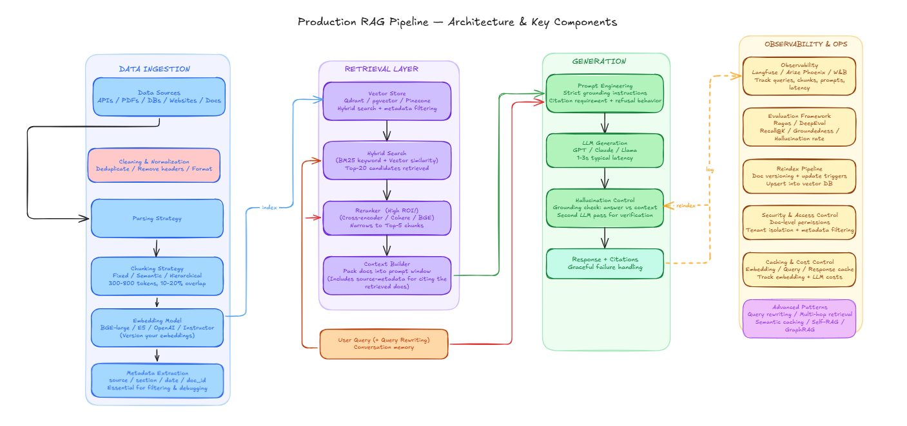
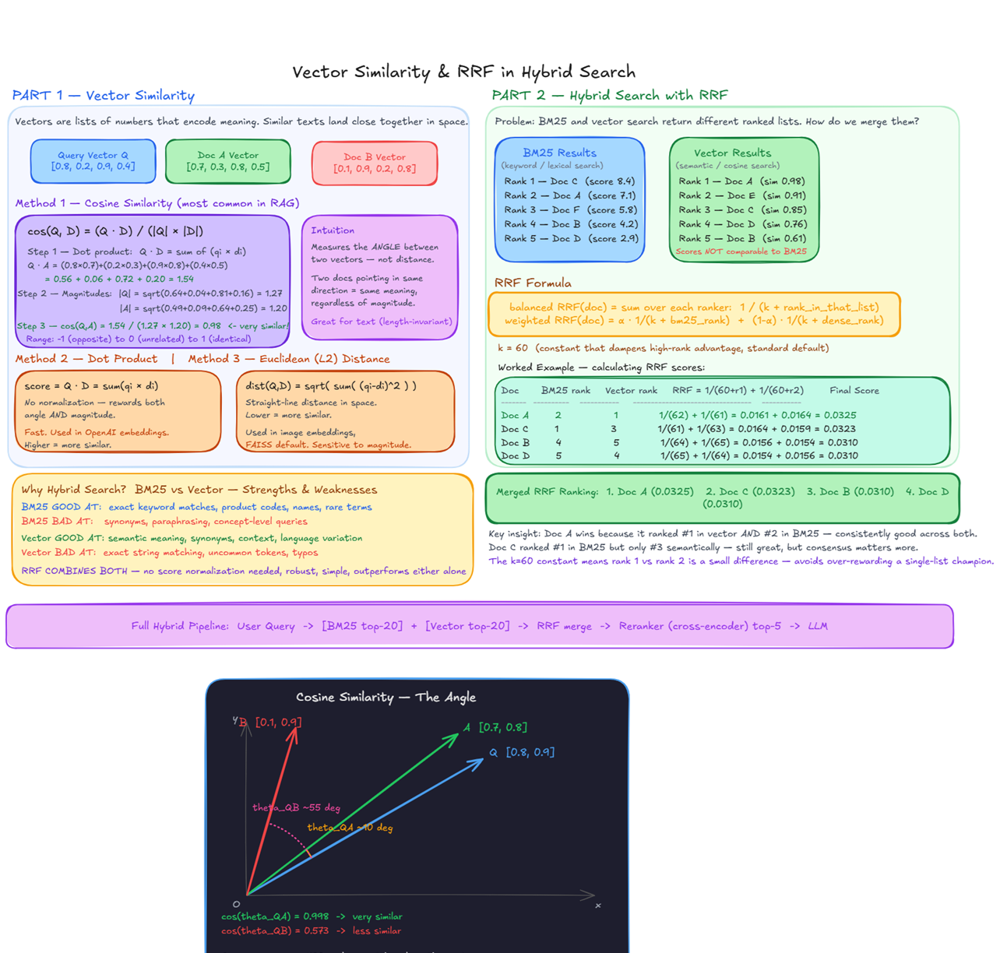

# RAG Pipeline

This module implements the **Data Ingestion** and **Retrieval** layers of the production RAG pipeline used by reachy-presenter.



---

## Overview

| Stage | File | What it does |
|---|---|---|
| Ingest | `ingest.py` | Parse → chunk → embed (dense + sparse) → store in Qdrant |
| Retrieve | `retrieve.py` | Hybrid search → rerank → build context string for LLM |

---

## Prerequisites

### 1. Install dependencies

```bash
pip install -r requirements.txt
```

### 2. Start Qdrant

```bash
docker run -d -p 6333:6333 -v qdrant_storage:/qdrant/storage qdrant/qdrant
```

Verify: `curl http://localhost:6333/healthz`

### 3. Configure `.env`

Copy `.env.example` to `.env` and fill in your values:

```bash
cp .env.example .env
```

| Variable | Required | Default | Description |
|---|---|---|---|
| `OPENAI_API_KEY` | If using `--provider openai` | — | OpenAI API key |
| `QDRANT_URL` | No | `http://localhost:6333` | Qdrant server URL |
| `CROSS_ENCODER_MODEL` | No | `cross-encoder/ms-marco-MiniLM-L-6-v2` | Reranker model |
| `COHERE_API_KEY` | If using `--reranker cohere` | — | Cohere API key |

### 4. (Optional) Start Ollama for local embeddings

```bash
# Install from https://ollama.com, then:
ollama pull nomic-embed-text
```

---

## Data Ingestion

Parses a PDF or PPTX file, splits it into chunks, embeds each chunk as both a **dense vector** (semantic) and a **sparse vector** (BM25), and stores everything in Qdrant.

Re-ingesting the same file is **idempotent** — existing chunks for that file are deleted before re-inserting. Document identity is based on a SHA-256 hash of the file contents, so renaming or moving the file does not orphan old chunks.

### Usage

```bash
python -m app.rag.ingest <file> [options]
```

### Arguments

| Argument | Default | Description |
|---|---|---|
| `file` | required | Path to PDF or PPTX file |
| `--provider` | `ollama` | Embedding provider: `openai` or `ollama` |
| `--model` | `nomic-embed-text` | Dense embedding model name |
| `--collection` | `reachy_collection` | Qdrant collection name |
| `--parser` | `docling` | Parser to use: `docling`, `pdfplumber`, or `python-pptx` |
| `--sparse-model` | `Qdrant/bm25` | Sparse (BM25) model for hybrid search |
| `--chunk-size` | `400` | Chunk size in tokens |
| `--chunk-overlap` | `60` | Overlap between consecutive chunks in tokens |
| `--eval` | `0` | Set to `1` to run retrieval eval immediately after ingestion |

### Examples

```bash
# Local embeddings (free, no API key needed)
python -m app.rag.ingest slides.pdf

# OpenAI embeddings
python -m app.rag.ingest slides.pdf --provider openai

# PPTX file with python-pptx parser
python -m app.rag.ingest deck.pptx --parser python-pptx

# Custom collection
python -m app.rag.ingest slides.pdf --collection my_collection
```

### Embedding providers

| Provider | Model | Dims | Notes |
|---|---|---|---|
| `ollama` (default) | `nomic-embed-text` | 768 | Local, free, no API key |
| `openai` | `text-embedding-3-small` | 1536 | Hosted, requires `OPENAI_API_KEY` |

> **Important:** Dense vector dimensions are fixed at collection creation time. Switching providers without changing `--collection` will fail. Use separate collection names per provider (e.g. `--collection slides_openai`).

### Parsers

| Parser | File types | Notes |
|---|---|---|
| `docling` (default) | `.pdf`, `.pptx` | Layout-aware chunking via HybridChunker |
| `pdfplumber` | `.pdf` | Extracts raw text per page |
| `python-pptx` | `.pptx`, `.ppt` | Extracts text from all shapes per slide |

---

## Retrieval

Given a query string, runs **hybrid search** (BM25 + dense vector) over the Qdrant collection to fetch candidate chunks, then **reranks** them to return the top-N most relevant chunks with source metadata.

### Usage

```bash
python -m app.rag.retrieve "<query>" [options]
```

### Arguments

| Argument | Default | Description |
|---|---|---|
| `query` | required | Natural language question or search string |
| `--collection` | `reachy_collection` | Qdrant collection to search |
| `--provider` | `ollama` | Embedding provider: `openai` or `ollama` |
| `--model` | `nomic-embed-text` | Dense embedding model (must match what was used at ingest) |
| `--sparse-model` | `Qdrant/bm25` | Sparse model (must match ingest) |
| `--reranker` | `cross-encoder` | Reranker to use: `cross-encoder` or `cohere` |
| `--top-n` | `5` | Number of final chunks to return after reranking |
| `--retriever-k` | `20` | Number of candidates fetched from Qdrant before reranking |

### Examples

```bash
# Basic query (local embeddings + cross-encoder reranker)
python -m app.rag.retrieve "what does slide 3 cover"

# With OpenAI embeddings
python -m app.rag.retrieve "key takeaways" --provider openai

# Cohere reranker (requires COHERE_API_KEY in .env)
python -m app.rag.retrieve "main findings" --reranker cohere

# Return top 3 chunks
python -m app.rag.retrieve "introduction" --top-n 3
```

### Output format

Each retrieved chunk is printed with its source file and page number:

```
[1] Source: /path/to/slides.pdf, Page: 4
<chunk text...>

[2] Source: /path/to/slides.pdf, Page: 1
<chunk text...>
```

### Rerankers

| Reranker | Model | Notes |
|---|---|---|
| `cross-encoder` (default) | `cross-encoder/ms-marco-MiniLM-L-6-v2` | Local, free, ~100–300ms |
| `cohere` | `rerank-english-v3.0` | Hosted, best quality, requires `COHERE_API_KEY` |

Override the cross-encoder model via `CROSS_ENCODER_MODEL` in `.env`.

**Bi-encoders vs cross-encoders** — bi-encoders (used in Stage 1) embed the query and each document independently, making them fast enough for large-scale retrieval but unable to model query-document interactions. Cross-encoders (used in Stage 2) take the query and a candidate document together as a single input, giving much richer relevance scoring at the cost of speed — which is why they're applied only to the top-20 shortlist, not the full collection. See: [Pinecone — Rerankers](https://www.pinecone.io/learn/series/rag/rerankers/)

---

## Python API

Both modules expose a clean function interface for use in other code:

```python
from app.rag.ingest import ingest
from app.rag.retrieve import retrieve, build_context

# Ingest
n = ingest("slides.pdf", provider="ollama")
print(f"Stored {n} chunks")

# Retrieve
chunks = retrieve("what is the main thesis?")
context = build_context(chunks)  # formatted string ready for LLM prompt
```

---

## Retrieval pipeline internals

```
User query
    │
    ▼
Hybrid Search (Qdrant)
  ├── Dense: nomic-embed-text / text-embedding-3-small
  └── Sparse: BM25 (Qdrant/bm25)
    │   top-20 candidates
    ▼
Reranker
  ├── cross-encoder/ms-marco-MiniLM-L-6-v2  (local)
  └── cohere rerank-english-v3.0             (API)
    │   top-N chunks
    ▼
build_context()  →  [1] Source: ...\n<text>\n\n[2] ...
```

---



## Retrieval Evaluation

### Overview

`eval.py` measures five IR metrics at both pipeline stages so you can see the retriever's recall ceiling and the reranker's precision/ordering contribution separately. Without measuring both stages independently, you cannot tell whether poor output comes from the retriever failing to surface the relevant chunk at all, or from the reranker pushing it out of the top-N window.

### Metrics

**Recall@K** — of all ground-truth relevant contexts, what fraction appeared in the top-K results? This is the primary metric for Stage 1: if Recall@20 is low, the reranker cannot help because the relevant chunks were never retrieved.

**Precision@K** — of the K results returned, what fraction were actually relevant? This is the primary metric for Stage 2: a good reranker should raise precision even if it slightly lowers recall. Precision and recall trade off against each other as K changes.

**Hit@K** — binary: was at least one relevant chunk in the top-K? Useful as a task-level success indicator. It does not distinguish between "one hit" and "five hits".

**MRR (Mean Reciprocal Rank)** — the average of 1/rank_of_first_relevant across all queries. Especially useful for tasks where the LLM uses only the top result.

**NDCG@K (Normalized Discounted Cumulative Gain)** — rewards placing relevant documents *higher* in the ranking. A result at rank 1 contributes more than the same result at rank 5. It is the only metric in this set that distinguishes "relevant at rank 1" from "relevant at rank K", and directly measures what the reranker is paid to do: ordering.

### Two-stage measurement

| Stage | K | What it measures |
|---|---|---|
| Stage 1: Retriever | 20 | Recall ceiling — the maximum recall the reranker can achieve |
| Stage 2: Reranker | top-n (default 5) | Precision + ordering quality of what reaches the LLM |

The **Delta** section compares Stage 2 against Stage 1 at the same K (not K=20) — apples-to-apples. A healthy reranker shows positive Precision and NDCG delta, and a small or zero Recall delta.

### Design tradeoff: re-parsing vs. scrolling Qdrant

Ragas `TestsetGenerator` needs LangChain `Document` objects (raw text) to build its knowledge graph. Two options:

**Scroll Qdrant** — use the Qdrant scroll API (a paginated full-table cursor scan, no query vector) to fetch all stored point payloads. Avoids re-running the parser but payloads hold *chunks* (400-token windows), not the original full pages. Ragas sees a fragmented view, which degrades knowledge graph quality and produces lower-quality test questions.

**Re-parse the file** (chosen) — call `parse(file_path)` again. Gives Ragas clean full-page text. Parser runtime is negligible compared to the LLM calls Ragas makes (dozens of GPT-4o-mini calls per testset).

### Custom datasets

The `--testset` flag accepts a JSON file with pre-labeled question/context pairs — the same format `--save-testset` produces. Works identically whether generated by Ragas or written by hand.

```json
[
  {
    "question": "What is the purpose of the hybrid retrieval mode?",
    "reference_contexts": [
      "Hybrid retrieval combines BM25 sparse vectors with dense embeddings..."
    ]
  }
]
```

Use hand-annotated datasets for regression testing specific known-hard queries or domain-specific terminology.

### Eval usage

```bash
# Ingest + eval in one command
python -m app.rag.ingest slides.pdf --eval 1

# Standalone eval — generate and save testset
python -m app.rag.eval slides.pdf --testset-size 10 --save-testset /tmp/ts.json

# Re-run with saved testset (no LLM generation cost)
python -m app.rag.eval slides.pdf --testset /tmp/ts.json

# Hand-crafted custom dataset
python -m app.rag.eval slides.pdf --testset /path/to/my_annotations.json

# Cohere reranker
python -m app.rag.eval slides.pdf --testset /tmp/ts.json --reranker cohere
```

---

## Verify end-to-end

```bash
# 1. Start Qdrant
docker run -d -p 6333:6333 qdrant/qdrant

# 2. Ingest
python -m app.rag.ingest slides.pdf

# 3. Retrieve
python -m app.rag.retrieve "your question here"

# 4. Check Qdrant dashboard
# Open http://localhost:6333/dashboard
# Verify collection "reachy_collection" has points with metadata fields:
#   source, doc_id, page, ingested_at, embedding_model
```
